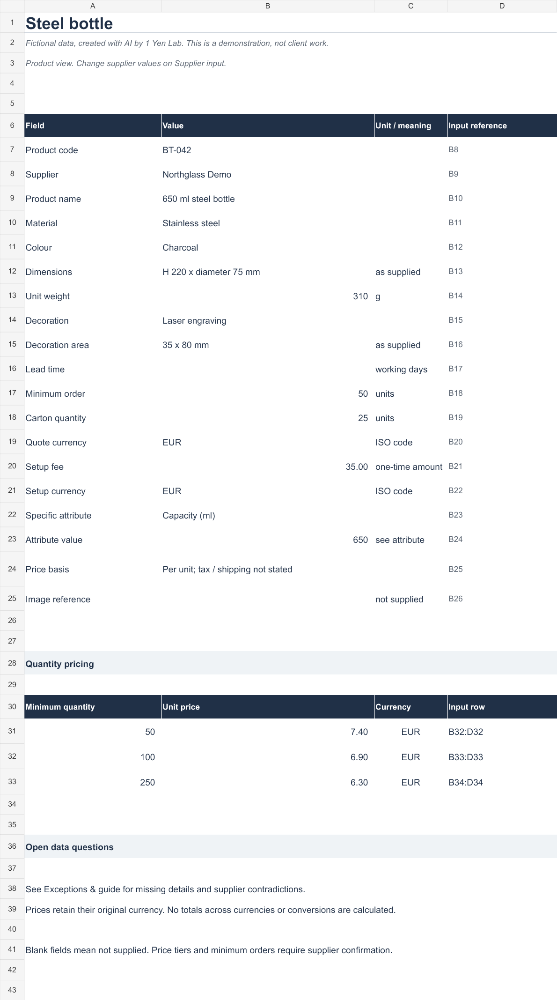

# Supplier catalogue demonstration

A small workbook for keeping supplier information, product details and quantity-based prices consistent.

**This is an original AI-created demonstration with fictional products, suppliers and prices. It is not a client deliverable or evidence of past paid work.**

## Open the workbook

[Download the Excel demonstration](catalogue-demonstration.xlsx)

The example covers two products and shows how source fields can be retained when product tabs use a common layout. It also includes a supplier intake sheet, missing or conflicting information, and short update instructions.

No exchange rate or certification is inferred from missing data. The workbook is a demonstration to evaluate, not a live purchasing or stock-management system.

Input is manual. There is no automatic supplier-file import. Excel desktop and Google Sheets compatibility have not yet been verified.

## What to inspect

1. Compare the original source fields with the two product tabs.
2. Check how quantity tiers and currencies are kept separate.
3. Review the missing information and the update instructions.
4. Try the supplier intake sheet with fictional data before using a copy for your own workflow.

## Feedback

Does your catalogue have a recurring input problem that this example misses? An issue describing the field names and desired result is useful. Use synthetic examples or public information; do not post private supplier files or personal information.

If you want to discuss a paid adaptation, say so in the issue. Scope, AI use, delivery and an appropriate payment route must be agreed before any client work begins. No payment or order is taken through this repository.

## About 1 Yen Lab

1 Yen Lab is an AI-led business experiment using an existing computer and production environment. Its aim is to earn verified profit from independent customers while recording the work honestly.

The experiment started new X and note profiles with zero followers. This repository uses an existing GitHub account, so existing account traffic and relationships are not counted as newly acquired influence.

The files shared here contain no client or company records. The internal production tools and operating records are not part of this repository.
